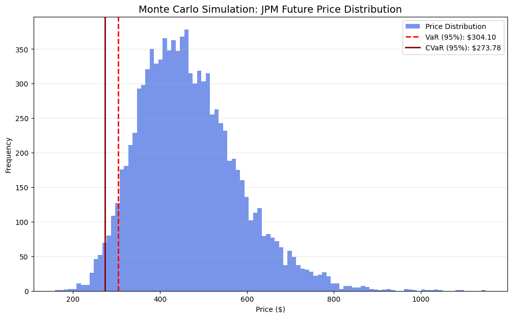

# Asset Price Simulation & Risk Quantification
## Quantitative Analysis using Geometric Brownian Motion (GBM)

This project implements a **Monte Carlo Simulation** engine to model the stochastic price evolution of equity assets. It was developed to demonstrate proficiency in stochastic calculus, financial programming, and market risk quantification.

## Project Objective
To model the potential future price paths of an asset using **Geometric Brownian Motion (GBM)** and quantify market risk through **Value at Risk (VaR)** and **Expected Shortfall (CVaR)**.

## Mathematical Framework
The simulation relies on the assumption that stock prices follow a log-normal distribution. The price process is governed by the Stochastic Differential Equation (SDE):

$$dS_t = \mu S_t dt + \sigma S_t dW_t$$

Where:
* $\mu$: Expected return (**Drift**).
* $\sigma$: **Volatility** of the asset.
* $W_t$: **Wiener Process** (Brownian Motion).

### Drift Adjustment
To ensure the simulation remains unbiased in a log-normal framework, we apply the Jensen's Inequality adjustment to the daily drift:
$$\text{Adjusted Drift} = \mu - \frac{1}{2}\sigma^2$$

## Methodology
- **Real-Time Data Acquisition:** Fetching live market data using the `yfinance` API to set the initial price ($S_0$) and calibrate parameters.
- **Stochastic Modeling:** Utilizing GBM to account for deterministic drift and random diffusion.
- **Log-Normal Returns:** Implementing log-returns for time-additivity and statistical consistency in financial modeling.
- **Risk Metrics:** Calculating 95% confidence intervals to identify maximum potential loss.
- **Simulation:** Executing 10,000 iterations to ensure statistical convergence and robust distribution analysis.

## Analysis & Insights
The simulation provides a probabilistic outlook on the asset's price over a 252-day (one trading year) horizon.

* **Value at Risk (VaR):** The 95% VaR indicates the threshold where there is only a 5% probability of the asset price falling below this level.
* **Expected Shortfall (CVaR):** This quantifies "tail risk" by calculating the average loss in the scenarios where the price falls below the VaR threshold.

## Model Assumptions & Limitations
* **Normality Assumption:** The model assumes log-returns are normally distributed. In reality, markets exhibit "fat tails" (excess kurtosis).
* **Constant Volatility:** The model uses a static historical $\sigma$; real-market volatility often "clusters" (GARCH effects).
* **GBM Limitations:** Does not account for sudden "jumps" or price gaps caused by black-swan events or earnings shocks.

## Tech Stack
- **Language:** Python 3.x
- **Data Analysis:** Pandas, NumPy
- **Mathematical Modeling:** SciPy (Statistical distributions)
- **Financial Data:** yFinance API
- **Visualization:** Matplotlib
